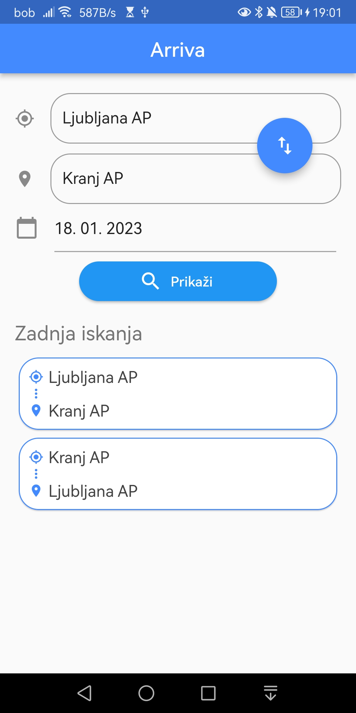
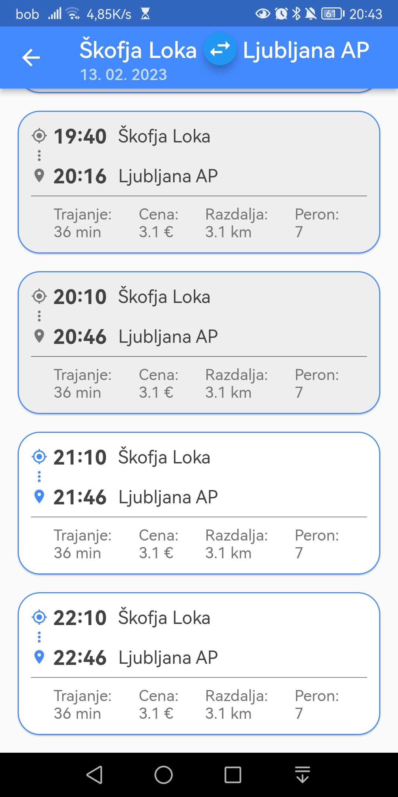

# Javni prevoz

Aplikacija je narejena z uporabo ogrodja Flutter in omogoča:
- Prikaz voznega reda za izbrano relacijo ponudnika Arriva.
- Prikaz zadnjih 10 iskanj.
- Odstranjevanje posameznih zapisov v seznamu zadnjih iskanj s podrsanjem v levo.

    
     

 

<!-- Deployment buildanje: 
flutter build apk --split-per-abi -t lib/src/screens/main.dart
flutter build apk -t lib/src/screens/main.dart
flutter install

ICONS:
flutter pub get
flutter pub run flutter_launcher_icons:main 
 -->