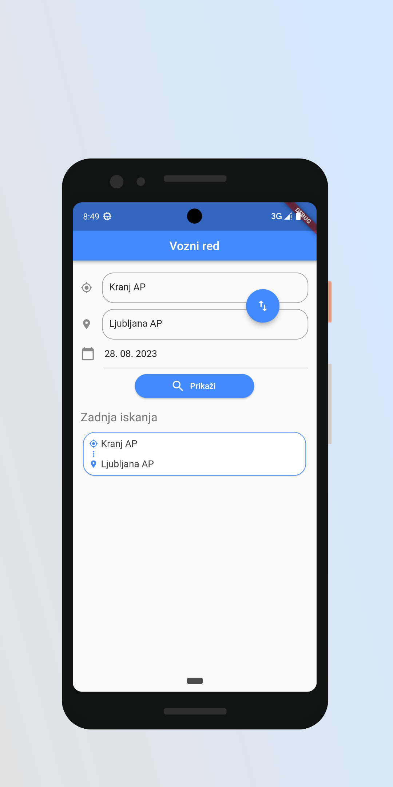
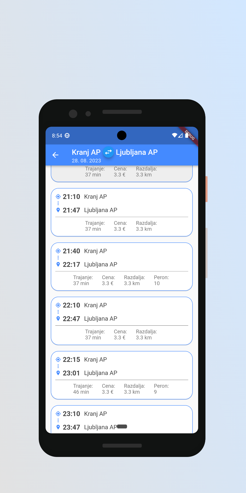
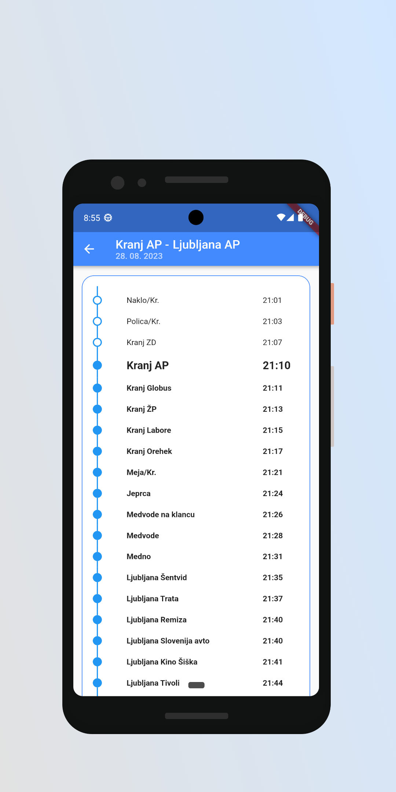

# Arriva vozni red

Aplikacija je narejena z uporabo ogrodja Flutter in omogoča:
- Prikaz voznega reda za izbrano relacijo ponudnika Arriva.
- Prikaz zadnjih 10 iskanj.
- Odstranjevanje posameznih zapisov v seznamu zadnjih iskanj s podrsanjem v levo.
- Dostopno na [Google Play](https://play.google.com/store/apps/details?id=com.tadson10.vozniRed&pcampaignid=web_share).

    
    
    

 

<!-- Deployment buildanje: 
flutter build apk --split-per-abi -t lib/src/screens/main.dart
flutter build apk -t lib/src/screens/main.dart
flutter install

ICONS:
flutter pub get
dart run flutter_launcher_icons 
 -->